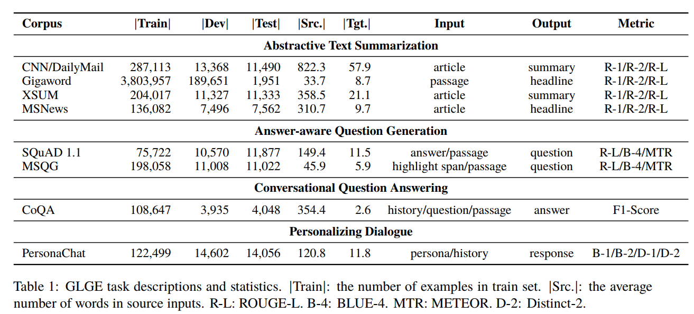

# GLGE: A New General Language Generation Evaluation Benchmark
[**Tasks**](#tasks) |
[**Dataset**](#get-dataset) |
[**Leaderboard**](https://microsoft.github.io/glge/) |
[**Baselines**](#get-baselines) |
[**Paper**](https://arxiv.org/abs/2011.11928)

## Updates 
* 2021-12-01: In order to facilitate researchers to evaluate their NLG models, we make the [test set](https://drive.google.com/file/d/11lDXIG87dChIfukq3x2Wx4r5_duCRm_J/view?usp=sharing) of GLGE public. The evaluation script can be found [here](https://github.com/microsoft/ProphetNet/tree/master/GLGE_baselines).
* 2021-05-11: We fixed the issue where inconsistent post-processing led to low ROUGE scores of our baselines for the gigaword test set.


## Introduction
This repository contains information about the general langugae generation evaluation benchmark GLGE, which is composed of 8 language generation tasks, including Abstractive Text Summarization (CNN/DailyMail, Gigaword, XSUM, MSNews), Answer-aware Question Generation (SQuAD 1.1, MSQG), Conversational Question Answering (CoQA), and Personalizing Dialogue (Personachat). In order to provide more diversified difficulty challenges, we provide 3 different difficulty versions (**easy**, **medium**, and **hard**) for each task.

The 8 NLG tasks in GLGE:




## Tasks
The 8 tasks in GLGE can be categorized into 4 groups: Abstractive Text Summarization tasks, Answer-aware Question Generation tasks, Conversational Question Answering task, and Personalizing Dialogue task.

### Abstractive Text Summarization Tasks

#### CNN/DailyMail
CNN/DailyMail `\cite{hermann2015cnndm}` dataset contains 220K articles from the Daily Mail newspapers, and 93K articles from the CNN. Each article contains a bullet point summary. GLGE use the non-anonymized variant used in `\cite{see2017get}`. After the pre-processing, there are 311,971 <article, summary> data pairs, where the source input is the article, and the target output is the summary which consists of multiple sentences. ROUGE-1, ROUGE-2, and ROUGE-L are used as the metrics.

#### Gigaword
Gigaword `\cite{rush2015neural}` contains 4M examples extracted from the news articles of the Gigaword corpus `\cite{graff2003gigaword}`. After the pre-processing, there are 3,995,559 <passage, summary> data pairs, where the source input is the the first sentence of the article, and the target output is the headline that often only contains a single sentence. ROUGE-1, ROUGE-2, and ROUGE-L are used as the metrics.

#### XSUM
XSUM `\cite{narayan2018don}` consists of 227K online articles from the British Broadcasting Corporation (BBC), which contains professionally written single-sentence summaries. After the pre-processing, there are 226,677 <article, summary> data pairs, where the source input is the the news article, and the target output is a single summary sentence. ROUGE-1, ROUGE-2, and ROUGE-L are used as the metrics.

#### MSNews
MicroSoft News headline generation (MSNews). We random select 151K online news articles from 2012-1-1 to 2020-9-1 from a real-world news search engine. Each article contains a professionally written single-sentence headline. After the pre-processing, there are 151,140 <article, headline> data pairs, where the source input is the news article, and the target output is a news headline. 

### Answer-aware Question Generation Tasks
#### SQuAD 1.1
SQuAD 1.1 `cite{rajpurkar2016squad}` dataset contains 536 Wikipedia articles with over 100k Amazon Mechanical Turks crowd-worker created questions posed about the articles with the corresponding answer span. Since the original hidden test set of the SQuAD 1.1 is hidden, we re-split the dataset with the examples from the original training set and dev set. After the pre-processing, there are 98,169 <answer, passage, question> data triples the source input is a Wikipedia passage along with an answer span, and the target output is a question. ROUGE-L, BLEU-4, and METEOR are used as the metrics.

#### MSQG
MicroSoft Question Generation (MSQG) is another dataset we collected, which is a new challenge dataset. the questions in this dataset are freely edited by daily users. For MSQG, we collect 220K passages from a real world search engine. Each passage contains a highlight span and a related query, we regard the queries as questions in this dataset. After the pre-processing, there are 220,088 <highlight span, passage, question> data triples, where the source input is a news passage along with highlight span, and the target output is a user question. ROUGE-L, BLEU-4, and METEOR are used as the metrics. 

### Answer-aware Question Generation Tasks

#### CoQA
CoQA `\cite{reddy2019coqa}` dataset contains 127K questions with answers, obtained from 8K conversations about text passages from seven diverse domains. After the pre-processing, there are 116,630 <conversation history, passage, question, answer> data 4-tuples, where the source input is a sequence of conversation history along with a given question and a give passage, and the target output is a free-form answer text. F1-Score is used as the metrics.

### Conversational Question Answering Task

#### PersonaChat
PersonaChat `\cite{zhang2018personalizing}` dataset is consist of 162,064 utterances, which require models generate responses according to given multi-turn conversations and persona profile. After the pre-processing, there are 151,157 <persona profile description text, conversation history, response> data triples, where the source input is a sequence of conversation history along with several sentences of persona profile description text, and the target output is a response. BLEU-1, BLEU-2, Distinct-1, and Distinct-2 are used as the metrics.


## Get Dataset
In order to use our dataset, please navigate to [GLGE Leaderboard](https://microsoft.github.io/glge/) and agree to our terms of service. After you do so a download link will be made available.


## Get Baselines
We put the baselines to ProphetNet [repo](https://github.com/microsoft/ProphetNet/tree/master/GLGE_baselines). It contains the pre-trained models, fine-tuning scripts, and evaluation scripts for GLGE.

The implementation of BART can refer to [repo](https://github.com/pytorch/fairseq/tree/master/examples/bart).

The implementation of MASS can refer to [repo](https://github.com/microsoft/MASS). 

It should be noted that, considering the computational cost, we have not carefully adjusted the hyperparameters of all baseline methods. Better results may be obtained by adjusting the default hyperparameters.

## Leaderboard Submission

### Submissions
To submit your predictions for evaluation, please create a single folder which contains the prediction files (see [submission_examples](submission_examples/) for an example). 
The prediction file shoud be named with the following format: `{task}.{version}.test` where `{version}` is the difficulty versions (**easy**, **medium**, and **hard**), task is the task name (**cnndm**, **gigaword**, **xsum**, **msnews**, **sqaudqg**, **msqg**, **coqa**, and **personachat** ).
Please validate that you have done this correctly by evaluating against the development file. Once that is done <a href='glge@microsoft.com'>email your submission</a>. We will reply with your model performance.

We allow **partial submission** of results, such as the result of a single task on the GLGE-easy.

In order to facilitate researchers to evaluate their NLG models, we make the [test set](https://drive.google.com/file/d/11lDXIG87dChIfukq3x2Wx4r5_duCRm_J/view?usp=sharing) of GLGE public. The evaluation script can be found [here](https://github.com/microsoft/ProphetNet/tree/master/GLGE_baselines).
 
## Paper
If you use our benchmark or dataset, please cite our paper `\cite{Liu2020GLGE}`.
```
@article{Liu2020GLGE,
  title={GLGE: A New General Language Generation Evaluation Benchmark},
  author={Dayiheng Liu, Yu Yan, Yeyun Gong, Weizhen Qi, Hang Zhang, Jian Jiao, Weizhu Chen, Jie Fu, Linjun Shou, Ming Gong, Pengcheng Wang, Jiusheng Chen, Daxin Jiang, Jiancheng Lv, Ruofei Zhang, Winnie Wu, Ming Zhou and Nan Duan},
  journal={arXiv},
  year={2020},
  volume={abs/2011.11928}
}
```

Additionally, since GLGE is also built out of exiting 6 datasets, please ensure you cite all of them. 

An example:
We evaluate our model using the GLGE benchmark `\cite{Liu2020GLGE}`, a general langugae generation evaluation benchmark consiting of CNN/DailyMail `\cite{hermann2015cnndm}` `\cite{see2017get}`, Gigaword `\cite{rush2015neural}` `\cite{graff2003gigaword}`, XSum `\cite{narayan2018don}`, MSNews, SQuAD 1.1 `cite{rajpurkar2016squad}`, MSQG, CoQA `\cite{reddy2019coqa}`, and PersonaChat `\cite{zhang2018personalizing}`.

Bibtex for external datasets used in GLGE:
```
@inproceedings{hermann2015cnndm,
  title={Teaching machines to read and comprehend},
  author={Hermann, Karl Moritz and Kocisky, Tomas and Grefenstette, Edward and Espeholt, Lasse and Kay, Will and Suleyman, Mustafa and Blunsom, Phil},
  booktitle={NIPS},
  pages={1693--1701},
  year={2015}
}

@inproceedings{see2017get,
  title={Get to the point: Summarization with pointer-generator networks},
  author={See, Abigail and Liu, Peter J and Manning, Christopher D},
  booktitle={ACL},
  pages={1073--1083},
  year={2017}
}

@inproceedings{rush2015neural,
  title={A neural attention model for abstractive sentence summarization},
  author={Rush, Alexander M and Chopra, Sumit and Weston, Jason},
  booktitle={EMNLP},
  pages={379-389},
  year={2015}
}

@article{graff2003gigaword,
  title={English gigaword},
  author={Graff, David and Kong, Junbo and Chen, Ke and Maeda, Kazuaki},
  journal={Linguistic Data Consortium, Philadelphia},
  volume={4},
  number={1},
  pages={34},
  year={2003}
}

@inproceedings{narayan2018don,
  title={Don't give me the details, just the summary! topic-aware convolutional neural networks for extreme summarization},
  author={Narayan, Shashi and Cohen, Shay B and Lapata, Mirella},
  booktitle={EMNLP},
  pages={1797--1807},
  year={2018}
}

@inproceedings{rajpurkar2016squad,
  title={Squad: 100,000+ questions for machine comprehension of text},
  author={Rajpurkar, Pranav and Zhang, Jian and Lopyrev, Konstantin and Liang, Percy},
  booktitle={EMNLP},
  pages={2383--2392},
  year={2016}
}

@article{reddy2019coqa,
  title={Coqa: A conversational question answering challenge},
  author={Reddy, Siva and Chen, Danqi and Manning, Christopher D},
  journal={TACL},
  volume={7},
  pages={249--266},
  year={2019}
}

@inproceedings{zhang2018personalizing,
  title={Personalizing dialogue agents: I have a dog, do you have pets too?},
  author={Zhang, Saizheng and Dinan, Emily and Urbanek, Jack and Szlam, Arthur and Kiela, Douwe and Weston, Jason},
  booktitle={ACL},
  pages={2204--2213},
  year={2018}
}

```
# Contributing

This project welcomes contributions and suggestions.  Most contributions require you to agree to a
Contributor License Agreement (CLA) declaring that you have the right to, and actually do, grant us
the rights to use your contribution. For details, visit https://cla.opensource.microsoft.com.

When you submit a pull request, a CLA bot will automatically determine whether you need to provide
a CLA and decorate the PR appropriately (e.g., status check, comment). Simply follow the instructions
provided by the bot. You will only need to do this once across all repos using our CLA.

This project has adopted the [Microsoft Open Source Code of Conduct](https://opensource.microsoft.com/codeofconduct/).
For more information see the [Code of Conduct FAQ](https://opensource.microsoft.com/codeofconduct/faq/) or
contact [opencode@microsoft.com](mailto:opencode@microsoft.com) with any additional questions or comments.

# Legal Notices

Microsoft and any contributors grant you a license to the Microsoft documentation and other content
in this repository under the [Creative Commons Attribution 4.0 International Public License](https://creativecommons.org/licenses/by/4.0/legalcode),
see the [LICENSE](LICENSE) file, and grant you a license to any code in the repository under the [MIT License](https://opensource.org/licenses/MIT), see the
[LICENSE-CODE](LICENSE-CODE) file.

Microsoft, Windows, Microsoft Azure and/or other Microsoft products and services referenced in the documentation
may be either trademarks or registered trademarks of Microsoft in the United States and/or other countries.
The licenses for this project do not grant you rights to use any Microsoft names, logos, or trademarks.
Microsoft's general trademark guidelines can be found at http://go.microsoft.com/fwlink/?LinkID=254653.

Privacy information can be found at https://privacy.microsoft.com/en-us/

Microsoft and any contributors reserve all other rights, whether under their respective copyrights, patents,
or trademarks, whether by implication, estoppel or otherwise.
